# Chapter 2. Logic Apps でアプリ開発

この Chapter では、Logic Apps を利用して、Custom Vision と連携して、画像の犬種判別ができるアプリを開発します。

## Logic Apps について

Azure Logic Apps を使うと、スケジュールやイベントをトリガーとして、コネクターを利用してアクションを制御し、ワークフローを構築することができます。

このハンズオンで実際に体感してみましょう。

## STEP2-1. Azure の設定確認

Azure Portal (URL: https://portal.azure.com/ ) を開き、**すべてのサービス** > **サブスクリプション** をクリック > 自身のサブスクリプションを選択 > **リソースプロバイダー** をクリックします。  
リソースプロバイダーの一覧で、**Microsoft.EventGrid** が 「Registerd」になっていることを確認します。  
「NotRegistered」の場合は、**Microsoft.EventGrid** をクリックし、上部の **登録** ボタンをクリックして登録します。

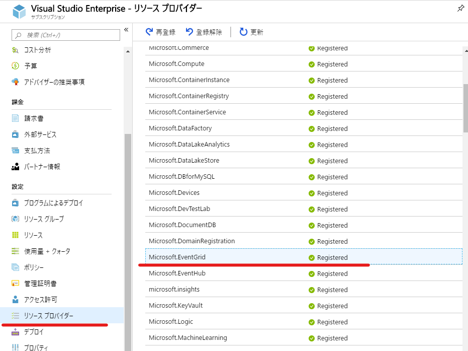

&nbsp;

## STEP2-2. Blob Storage の作成

[README](../README.md) の概要の図の通り、アプリで2つのストレージを利用します。

- 画像用ストレージ: 犬の画像をアップロードした際に保存するストレージ
- 分析結果用ストレージ: 分析結果を保存するストレージ

これらを Azure の Blob Storage で作成します。  
まず、Azure Portal (URL: https://portal.azure.com/ ) を開き、左側にある **リソースの作成** をクリックします。

&nbsp;

検索欄に「storage」と入力して **ストレージアカウント** を選択し、**作成** ボタンをクリックします。ストレージアカウントの作成画面（基本タブ）が表示されます。

まず、画像用ストレージを作成しましょう。以下を参考に詳細情報を入力します。

- **サブスクリプション**: 任意のサブスクリプションを選択
- **リソースグループ**: Capter1で作成したリソースグループを選択
- **ストレージアカウント名**: 任意の名称を入力します。Azure上で一意になる必要があります。（例:「input201905takahashi」）
- **場所**: 「(アジア太平洋)東日本」
- **パフォーマンス**: 「Standard」
- **アカウントの種類**: 「BlobStorage」
- **レプリケーション**: 「ローカル冗長ストレージ (LRS)」
- **アクセス層 (既定)**: 「ホット」

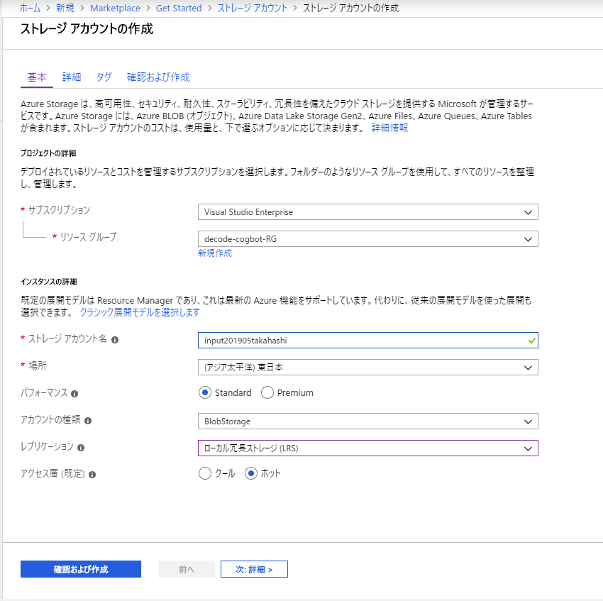

&nbsp;

入力後、**確認および作成** ボタンをクリックし、**作成** ボタンをクリックします。

同様の手順で、分析結果用ストレージも作成します。ストレージアカウント名に用途がわかるような任意の名称（例:「results201905takahashi」）を付けましょう。

作成が完了したら次は、それぞれのリソースで画像や分析結果を保存するにはコンテナー（PCのフォルダーのようなものと思っていただいて問題ありません）が必要です。

Azure ポータルで今回作成したリソースグループを開きます。

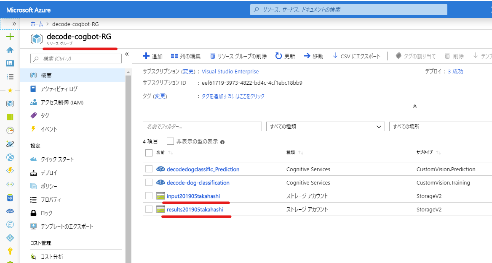

&nbsp;

まず、画像用の Blob Storage をクリックして、**BLOB** をクリックします。

&nbsp;

新しいコンテナーで、以下を入力します。

- **名前**: 「images」
- **パブリックアクセスレベル**: 「コンテナー (コンテナーと BLOB の匿名読み取りアクセス)」

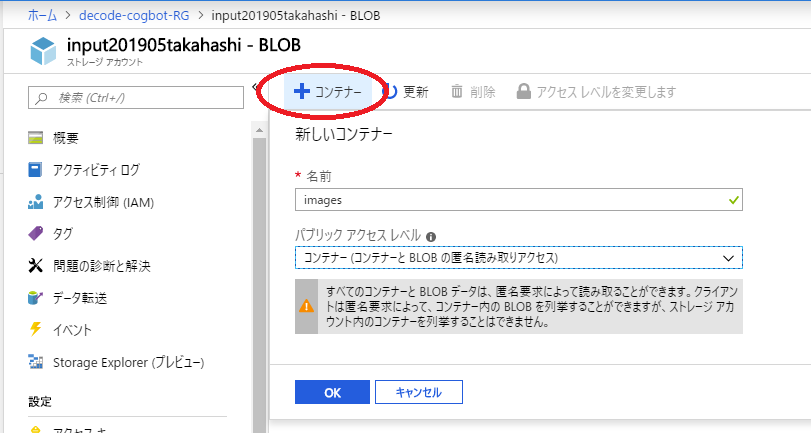

&nbsp;

同様の手順で、Azure ポータルで今回作成したリソースグループから、保存用の Blob Storage をクリックして、**BLOB** をクリックし、以下の情報でコンテナーを作成します。

- **名前**: 「results」
- **パブリックアクセスレベル**: 「コンテナー (コンテナーと BLOB の匿名読み取りアクセス)」

&nbsp;

## STEP2-3. Logic Apps でアプリを開発

Azure Portal 左側にある **リソースの作成** をクリックします。

&nbsp;

「logic App」と入力して、サービスをクリックし、**作成** ボタンをクリックします。

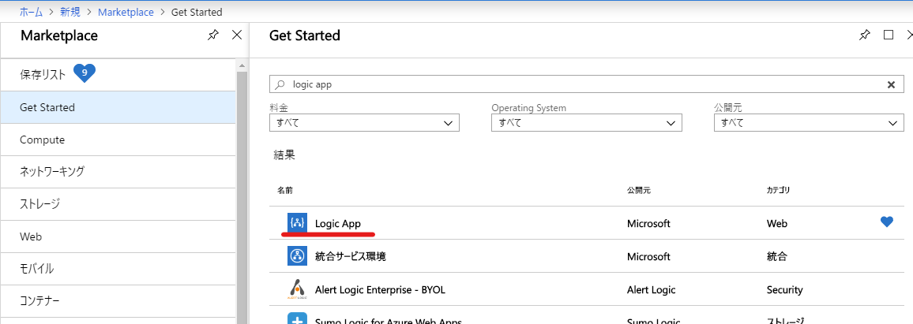

&nbsp;

以下を参考に詳細情報を入力します。入力後、**作成**ボタンをクリックします。

- **名前**: 任意の名前を入力（例:「dog-app」）
- **サブスクリプション**: 任意のサブスクリプションを選択
- **リソースグループ**: 「既存のものを使用」をチェックして、今回利用しているリソースグループを選択
- **場所**: 「東日本」
- **Log Analytics**: 「Off」

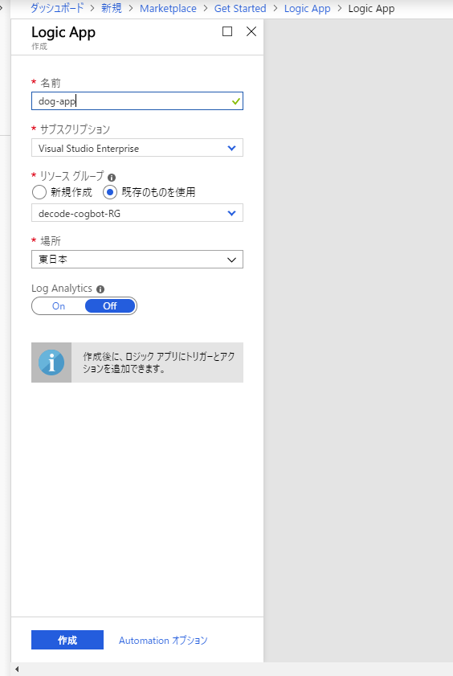

&nbsp;

作成が完了したら、Logic Apps を開きましょう。**Logic Apps デザイナー** が表示されます（表示されない場合は、Logic Apps のリソースのメニューから **Logic アプリデザイナー** をクリックします）。

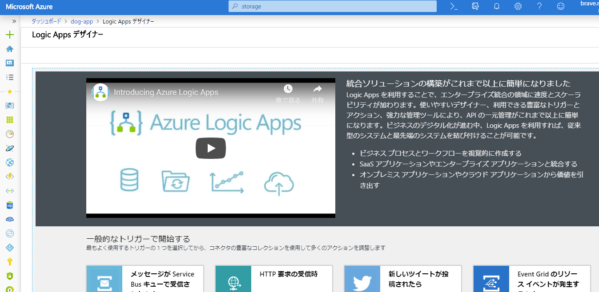

&nbsp;

### "Event Grid Publish" の設定

トリガーとして、**Event Grid のリソースイベントが発生するとき** をクリックします。  
ここでは、Blob に犬の画像をアップロードしたことを検知する仕組みを構築します。

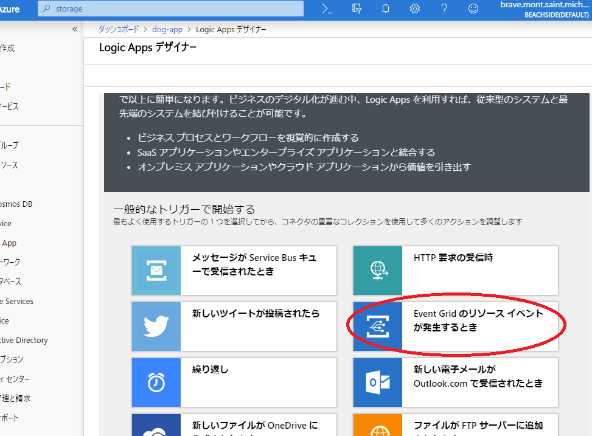

&nbsp;

**サインイン** をクリックし、自身のアカウントでサインインします。

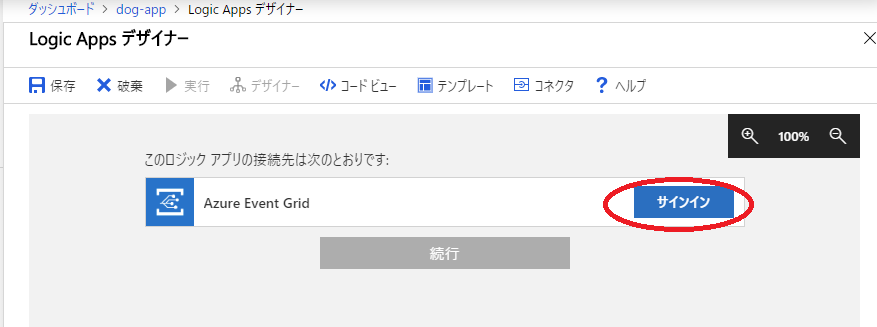

&nbsp;

接続して緑色のチェックが表示されたら、**続行** ボタンをクリックします。ウインドウが表示されますので、以下を参考に詳細情報を入力します。

- **LSubscription**: 任意のサブスクリプションを選択
- **Resource Type**: 「Microsoft.Storage.StorageAccounts」
- **Resource Name**: 保存用のストレージを選択
- **Event Type Item - 1**: 「Microsoft.Storage.BlobCreated」

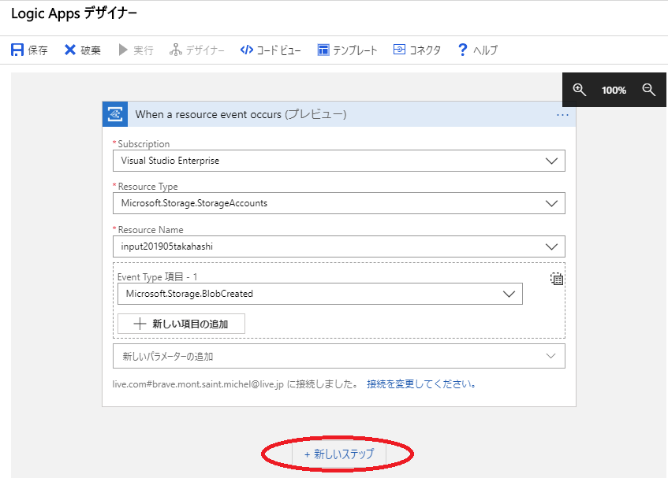

これで、設定した Azure のストレージアカウントで、Blob が新規作成された際（= 画像がアップロードされた際）に、Event Grid が検知して動作を開始するようになります。

&nbsp;

入力後、下部にある **新しいステップ** をクリックします。  

### "JSON の解析" の設定（1）

次は、検索に「json」と入力し、**JSON の解析** をクリックします。  
ここでは、Event Grid が検知した結果の JSON を解析する設定を行います。

&nbsp;

**JSON の解析** で、詳細情報を入力します。

- **コンテンツ**: **動的なコンテンツの追加** をクリックし、「本文」を選択
- **スキーマ**: [こちらの Json スキーマ（このGitHubリポジトリーの src > logicapp-input-schema.json）](../src/logicapp-input-schema.json)を貼り付けます。

&nbsp;

入力後、下部にある **新しいステップ** をクリックします。  

### "HTTP" の設定

> 参考: Custom Vison の専用コネクターが存在しますが、Custom Vision の Update により一時的にコネクターの利用ができなくなっています。その代替として、**HTTP** のコネクターを利用します。

「http」と入力し、**HTTP** をクリックします。  
 ここでは、Custiom Vision の API へ HTTP リクエストを行う設定をします。その際、前項で解析した JSON の中からBlob Storage へアップロードされた画像の URL を使います。

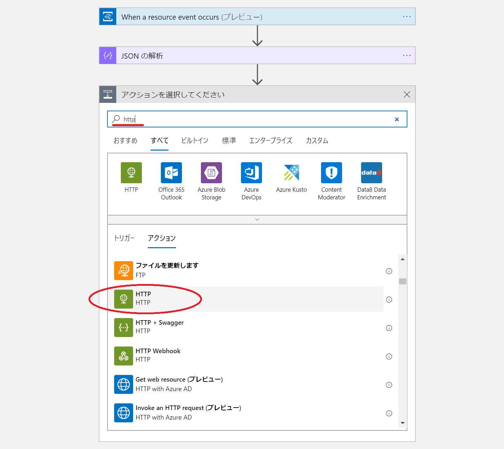

入力に必要な情報を取得するため、Custom Vision ポータルを開きます。画面上部の **Performance** をクリック > **Prediction URL** をクリックします。  

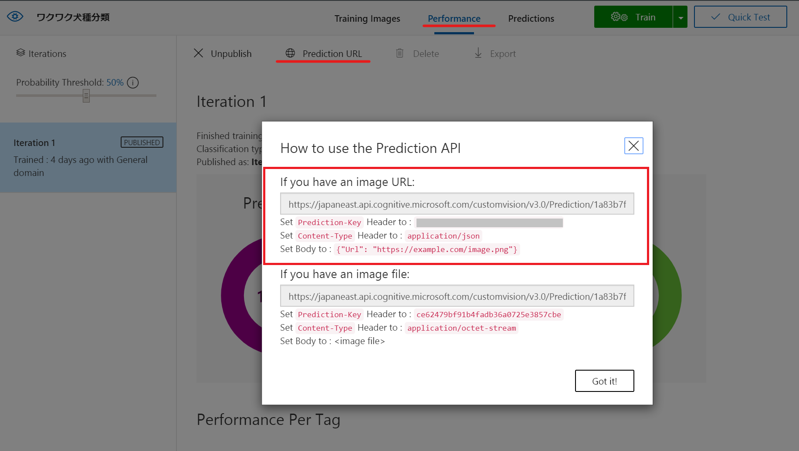

表示された値を参考（上図）に、Azure ポータルで、**HTTP** の詳細情報を入力します。設定すると、下図の

- **方法**: 「POST」
- **URL**: Custom Vision ポータルの image URL で指定されている URL
- **ヘッダ**: Custom Vision ポータルに記載がある **Prediction-Key** と **Content-Type** の二つを設定
- **本文**: Custom Vision ポータルの **Set Body to** の値を設定。ただし、Url の値は、**動的なコンテンツの追加** > **url** を設定。

&nbsp;

入力後、下部にある **新しいステップ** をクリックします。  

### "JSON の解析" の設定（2）

次は、検索に「json」と入力し、**JSON の解析** をクリックします。  
ここでは、前項で行った Custom Vision API へのリクエストの結果の JSON を解析する設定を行います。

- **コンテンツ**: **動的なコンテンツの追加** をクリックし、HTTPの「本文」を選択
- **スキーマ**: [こちらの Json スキーマ（このGitHubリポジトリーの src > custom-vision-output-schema.json）](../src/custom-vision-output-schema.json)を貼り付けます。

&nbsp;

入力後、下部にある **新しいステップ** をクリックします。  

### "For each" の設定

「for each」と入力し、**For each** をクリックします。  
 ここでは、前項で取得した結果のJSON を、分析結果用ストレージに保存します。

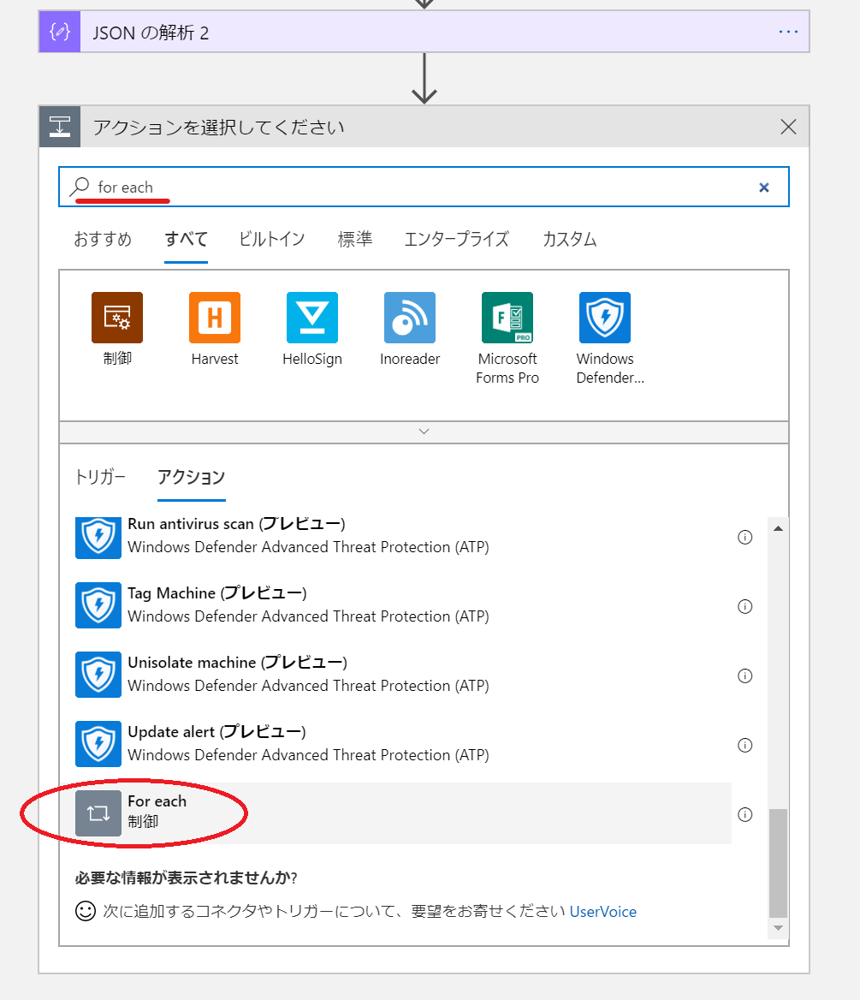

&nbsp;

- **以前の手順から出力を選択**:  **動的なコンテンツの追加** をクリックし、**predictions** を選択

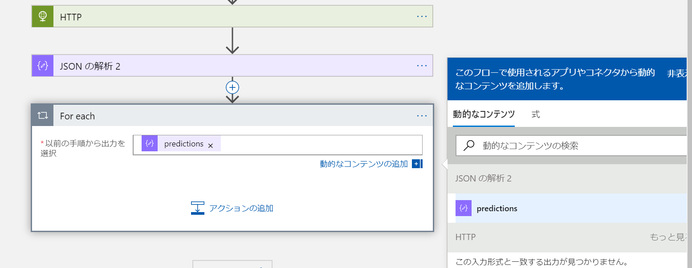

&nbsp;

入力後、**アクションの追加** をクリックします。

次は、検索に「条件」と入力し、**条件** をクリックします。  

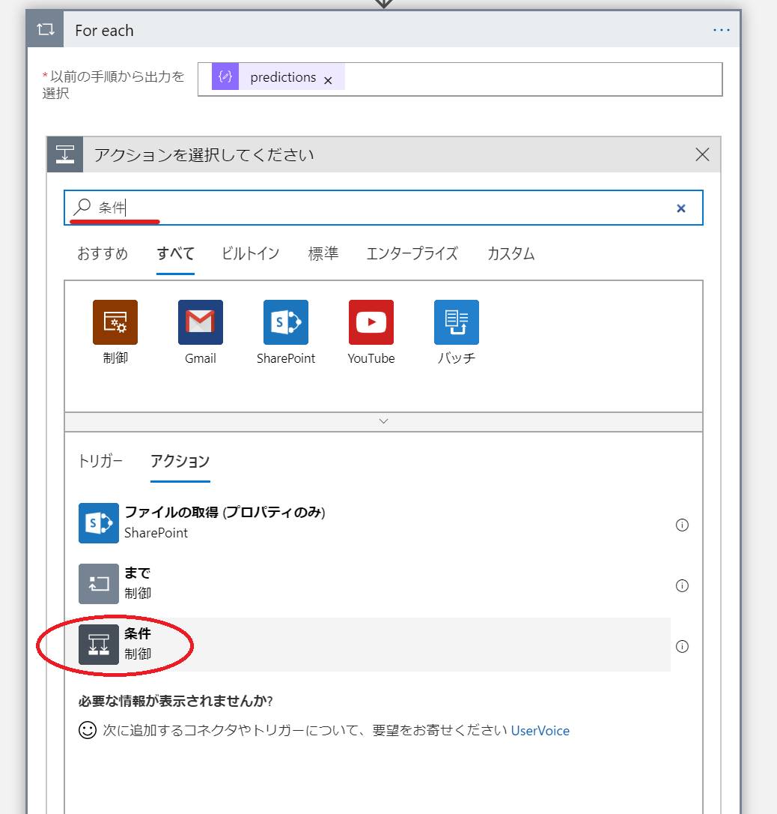

&nbsp;

以下図のように、値の選択には、**動的なコンテンツの追加** > **JSONの解析2** の **probability** を選択します。その値が、0.7 以上という条件を設定します。  

これは、Custom Vision API で予測した犬種の probability（確率）が 0.7以上（0 ~ 1.0）の場合、true を返す設定です。  
この値は Custom Vision の精度やアプリの目的に応じて変更しましょう。

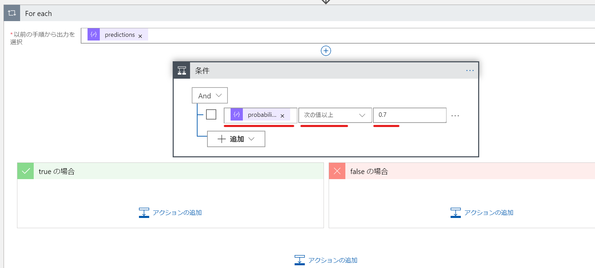

&nbsp;

**ture の場合** の **アクションの追加** をクリックします。

「azure blob」と入力して検索し、**BLOB の作成** をクリックします。

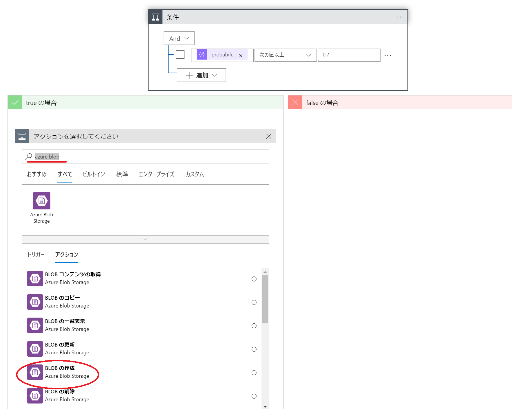

&nbsp;

以下を参考に詳細情報を入力します。

- **接続名**: 任意の名称を入力（例:「results」）
- **ストレージアカウント**: 作成した分析結果用ストレージを選択

入力後、**作成** ボタンをクリックします。

さらに詳細情報を入力します。

- **フォルダーのパス**: 「results」を選択
- **BLOB名**: **動的なコンテンツの追加** > **JSONの解析2** の **もっと見る** をクリック > **id** をクリック。次に「_」と直接入力。次に、**動的なコンテンツの追加** > 式の入力欄に「last(split(body('JSON_の解析')?['subject'], '/'))」と入力（下図参照）。最後に「.txt」と直接入力。これでCustom Vision の処理IDと、アップロードしたファイル名を表示しています。
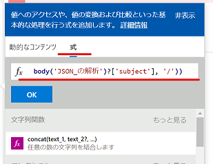
- **BLOB コンテンツ**: **動的なコンテンツの追加** > **JSONの解析2** の **もっと見る** をクリック  > **tagName** を選択。次に「: 」と直接入力。次に、再度 **動的なコンテンツの追加** > **JSONの解析2** の **もっと見る** をクリック > **probability** を選択。

&nbsp;

最後に、画面上部の **保存** ボタンをクリックします。保存が成功したら、**実行** ボタンをクリックして、動作する状態にしておきましょう。

ここまでで、ファイルをアップロードしたら、Event Grid が検知して Logic Apps を起動し，Custom Vision API を呼び出して画像の分類を行い、結果を保存できるようになりました。

&nbsp;

## 動作確認

開発したアプリの動作を確認してみましょう。

Logic Apps を開いているブラウザーのタブとは別のタブで Azure ポータルを開き、画像用ストレージを開きましょう（作成したリソースグループを開いて探すと容易です）。

**概要** > **BLOB** をクリックします。

&nbsp;

「images」コンテナーをクリックします。

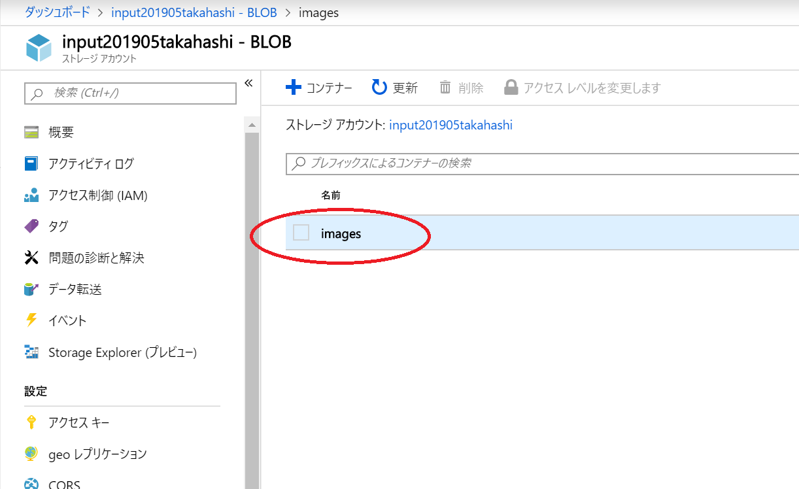

&nbsp;

画面上部の**アップロード** をクリックすると、BLOBのアップロードブレードが表示されます。 ファイルの選択ボタンをクリックし、テスト用の犬の画像を選択し、**アップロード** ボタンをクリックすると、画像がアップロードされます。

&nbsp;

Azure ポータルで、Logic Apps の**概要**から、**実行履歴**を見てみましょう。履歴が確認できます。  
履歴をクリックして、ログを確認することができます。失敗している場合は、ここから原因を解析しましょう。

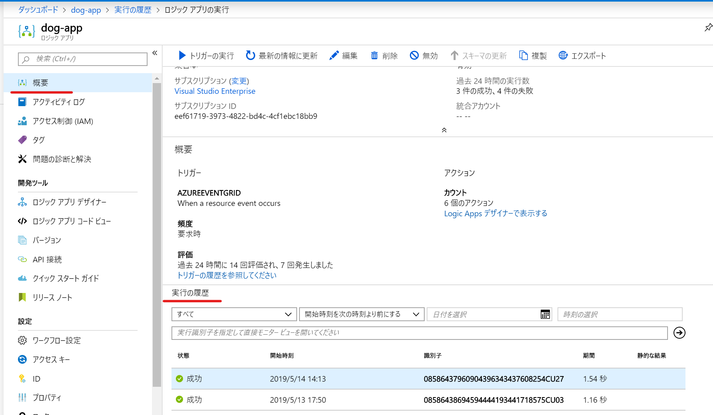

&nbsp;

ここで画像や評価結果は、前 Chapter で確認した通り、Custom Vision ポータルの **Predictions** から確認し、評価に誤りがある場合は、正しいタグをつけて再学習することで、分類器の精度を向上させることが可能です。

&nbsp;

## NEXT STEP

**おめでとうございます！**:star2:  
機械学習のコーディングなしで、動画をアップロードしたことをトリガーに、犬の画像分類ができるアプリの開発ができました。

より詳しい情報は、それぞれの公式ドキュメントをご確認いただき、より実践的なアプリの開発に挑戦して頂けれと思います。

- [Azure Custom Vision ドキュメント](https://docs.microsoft.com/ja-jp/azure/cognitive-services/custom-vision-service/)
- [Azure Logic Apps ドキュメント](https://docs.microsoft.com/ja-jp/azure/logic-apps/)

&nbsp;

これでハンズオンは終了となります。

次の Chapter では、今回作成したリソースが不要な場合、削除します。

---

[戻る](./01_create-custom-vision.md) | [次へ進む](./03_cleanup_resources.md)